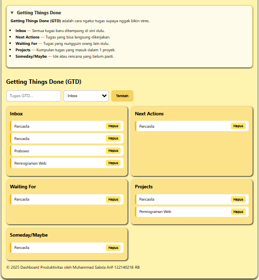

# CheeseNote - Dashboard Produktivitas Super Gampang

**CheeseNote** adalah aplikasi web sederhana buat bantu kamu jadi lebih produktif. Gak perlu daftar, gak perlu internet. Langsung pakai aja!

Kamu bisa:
- Nulis daftar tugas (Todo List)
- Pakai timer kerja (Pomodoro)
- Atur prioritas tugas (Eisenhower Matrix)
- Kelola tugas dengan metode GTD (Getting Things Done)

Semua data disimpan otomatis di browser kamu. Jadi gak usah takut datanya hilang. Bisa dipakai offline juga!

## Fitur-fitur Keren
- **Todo List:** Tulis, edit, atau hapus tugas harian dengan mudah.
- **Pomodoro Timer:** Bekerja fokus selama 25 menit, lalu istirahat. Ulangi sampai selesai!
- **Eisenhower Matrix:** Bantu kamu milih tugas mana yang penting dan mendesak.
- **GTD:** Bagi tugas jadi beberapa kategori biar gak bingung ngerjainnya.

- Hasil Deploy Pertemuan 2 [Klik Disini.](https://pemrograman-web-itera-122140218-pertemuan2.vercel.app)  
  
  
  
  
