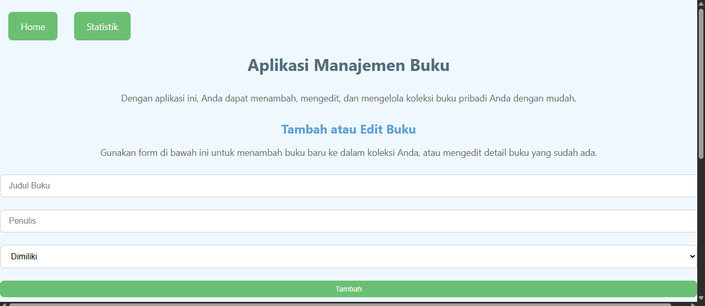
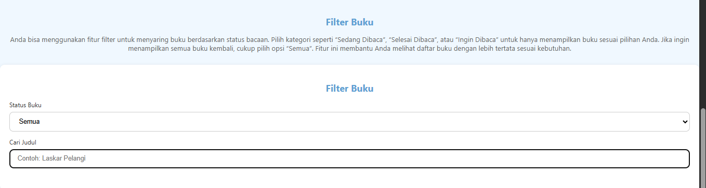
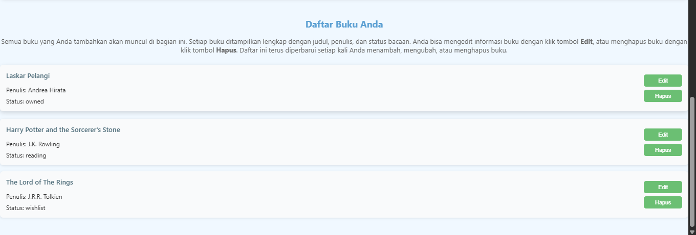
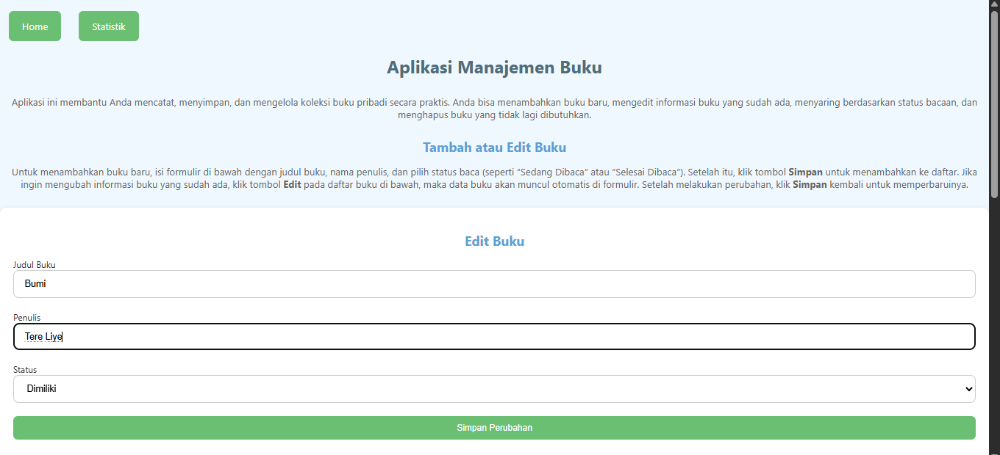
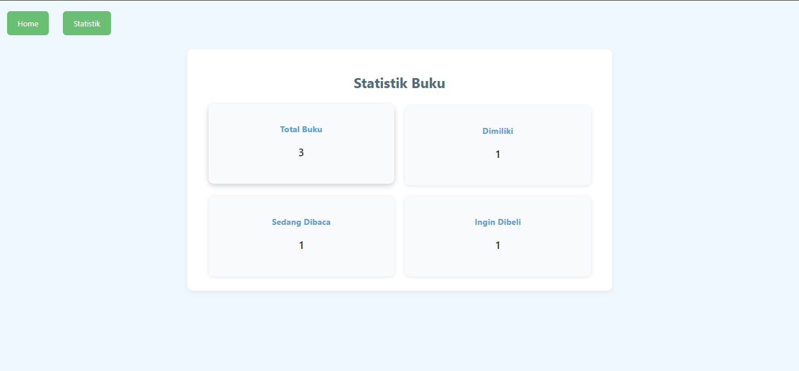

# Aplikasi Manajemen Buku

Aplikasi ini dibuat menggunakan React untuk membantu pengguna mencatat dan mengelola daftar buku. Pengguna dapat menambahkan buku baru, mengedit informasi buku, menghapus buku yang tidak diperlukan, serta memfilter daftar buku berdasarkan status atau pencarian judul.

---

## Deskripsi Aplikasi

Aplikasi ini terdiri dari 3 bagian utama:

1. **Form Tambah / Edit Buku**  
   - Input untuk judul buku dan penulis  
   - Dropdown untuk memilih status buku (Dimiliki, Sedang Dibaca, Ingin Dibeli)  
   - Tombol untuk menambahkan atau memperbarui data buku

2. **Filter Buku**  
   - Dropdown untuk menyaring status buku  
   - Input pencarian judul buku

3. **Daftar Buku**  
   - Menampilkan buku-buku yang ditambahkan  
   - Tombol untuk mengedit atau menghapus buku dari daftar

- Hasil Deploy Pertemuan 3 [Klik Disini.](https://pemrograman-web-itera-122140218-pertemuan3.vercel.app)
# Hasil ScreenShot Halaman
  
  
  
  
  
    
